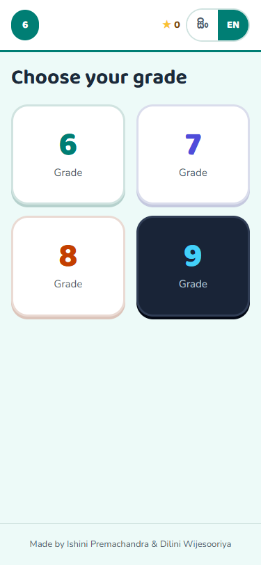
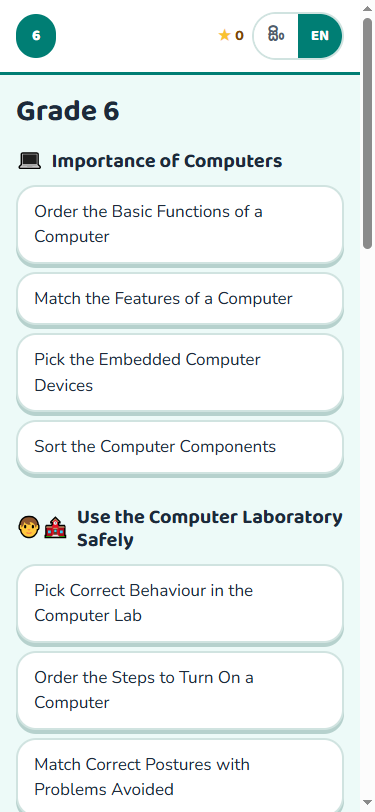
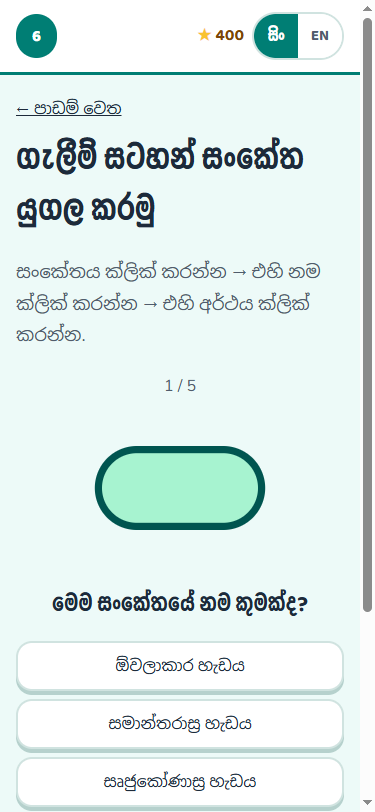
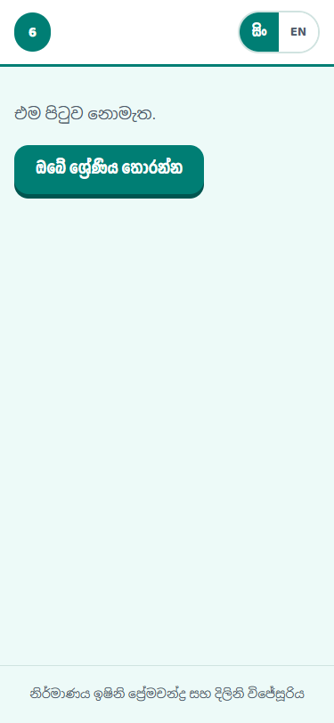
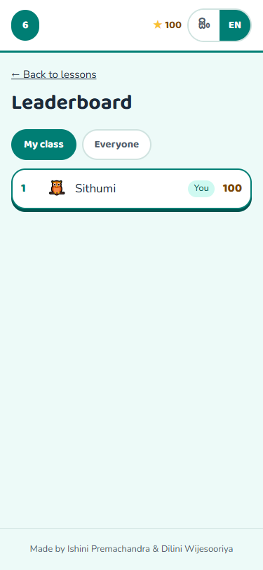
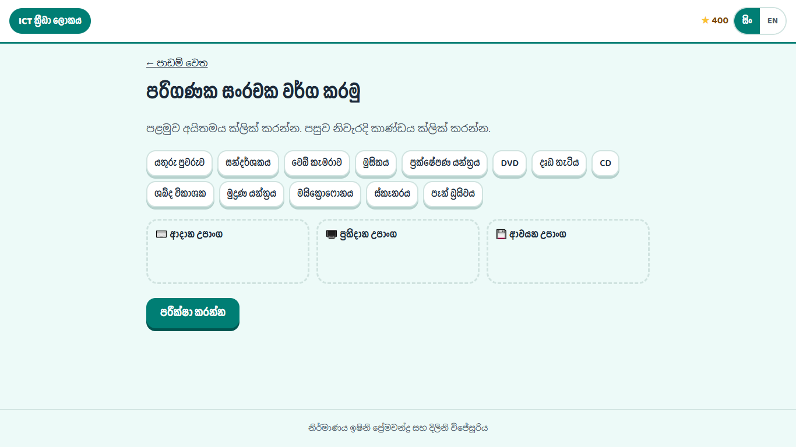

<h1 align="center">ICT Game World</h1>

<p align="center">
  <b>ICT games for Sri Lankan school students, in Sinhala and English.</b><br/>
  Grades 6 to 9, built on the NIE syllabus, playable on a phone or an old lab PC.
</p>

<p align="center">
  
  
  
  
  
  
  
</p>

<p align="center">
  <sub>Made by <b>Ishini Premachandra</b> and <b>Dilini Wijesooriya</b></sub>
</p>

---

## What this is

Sri Lanka's junior secondary ICT syllabus is taught in schools where the computer lab is often old, the
connection is often gone, and most students read Sinhala before they read English. This is a set of
practice games for that room.

It started as nine separate HTML files, one per grade and language, each with its own copy of the game
engine glued to its own copy of the content. This repository is those nine files rebuilt as **one app**:
a shared engine, one bilingual data file per grade, and a design system that changes colour for each
grade. It installs to a phone, works with the network off, and keeps a class leaderboard when the
network comes back.

Every activity maps to a numbered competency level in the National Institute of Education syllabus, and
a script checks that mapping on every run.

---

## A look at it

<table>
<tr>
<td width="33%" valign="top">
<br/>
<sub><b>Pick a grade</b> - each grade is its own colour world. Grade 9 is a dark night lab, so it feels older than grade 6.</sub>
</td>
<td width="33%" valign="top">
<br/>
<sub><b>Work through the lessons</b> - activities grouped by lesson, with stars for a best score.</sub>
</td>
<td width="33%" valign="top">
<br/>
<sub><b>Play in Sinhala or English</b> - one tap switches the language, fonts and type scale together.</sub>
</td>
</tr>
<tr>
<td width="33%" valign="top">
<br/>
<sub><b>Pick a nickname</b> - a nickname, a buddy and an optional class code. No real names are ever collected.</sub>
</td>
<td width="33%" valign="top">
<br/>
<sub><b>Compare with the class</b> - your own row is marked. Works offline and syncs when the connection returns.</sub>
</td>
<td width="33%" valign="top">
<br/>
<sub><b>Same game on a lab PC</b> - one layout, from a 360px phone up to a desktop.</sub>
</td>
</tr>
</table>

---

## The four grade worlds

Components never change between grades. Only `data-grade` on `<body>` changes, and the colours follow.

| Grade | World | Base | Page |
|---|---|---|---|
| 6 | Teal | `#007e74` | `#edfaf8` |
| 7 | Indigo | `#4f4cda` | `#f4f6ff` |
| 8 | Orange | `#c43f00` | `#fff4ef` |
| 9 | Night lab | `#43d0f9` | `#0d1626` |

Headings use Baloo 2 in English and Yaldevi in Sinhala; body text uses Nunito and Noto Sans Sinhala.
Sinhala gets a slightly larger type scale and a taller line height, because its letters stack above and
below the line and cramping them breaks the shapes.

---

## Syllabus coverage

Checked against the four official NIE syllabi on every run of `scripts/check-syllabus.mjs`.

| Grade | Competency levels | Periods | Activities |
|---|---|---|---|
| 6 | 14 / 14 | 30 | 28 |
| 7 | 18 / 18 | 30 | 36 |
| 8 | 10 / 10 | 30 | 22 |
| 9 | 17 / 17 | 30 | 26 |
| **Total** | **59 / 59** | **120** | **112** |

Plus 18 bonus mini games folded in from the grade 9 ICT Adventure set.

---

## How it is put together

**No build step.** Plain ES modules, plain CSS, served as files. There is nothing to compile, which
means a teacher can open `index.html` and it runs.

```
index.html          the shell
css/tokens.css      the design system: colours, type, spacing, motion
css/app.css         screens and components, built only from those tokens
js/app.js           hash router and the three main screens
js/activities/*.js  one module per activity type
data/grade-N.json   lessons, activities and answers, {en, si} on every string
original/           the nine source games, untouched, as the parity baseline
scripts/            extraction and the checks
supabase/           the leaderboard schema
```

### The data model is the point

Every piece of text is either a plain string, or `{ en, si }` when it is something a child reads:

```jsonc
{
  "id": "1.3",
  "type": "pick",
  "name": { "en": "Pick the Embedded Computer Devices", "si": "නිහිත පරිගණක සහිත උපකරණ තෝරන්න" },
  "items": [
    { "text": { "en": "Smartphones", "si": "සුහුරු ජංගම දුරකථන" }, "icon": "📱", "correct": true }
  ]
}
```

Icons and answers stay plain, so a translator can never accidentally translate `true`. There is room for
`ta` when Tamil is added.

### Nothing was lost in the rebuild

The nine original games are kept byte for byte in `original/`. `scripts/check-data.mjs` rebuilds each
language's view out of the JSON and compares it against the original file it came from, so extraction is
provably lossless rather than hopefully lossless.

```
$ node scripts/check-data.mjs
ok    grade 6  8 lessons, 28 activities (22 original + 6 new), en + si original rebuild matches exactly
ok    grade 7  8 lessons, 36 activities (29 original + 7 new), en + si original rebuild matches exactly
ok    grade 8  7 lessons, 22 activities (14 original + 8 new), en + si original rebuild matches exactly
ok    grade 9  7 lessons, 26 activities (19 original + 7 new), en original rebuild matches exactly
ok    adventure  6 lessons, 18 mini games, rebuild matches original exactly
```

---

## Running it

Any static server will do:

```bash
npx serve .
```

Then open the address it prints. To rebuild the data files from the originals and re-run the checks:

```bash
node scripts/extract.mjs        # original/ + content/ -> data/
node scripts/check-data.mjs     # parity against the originals
node scripts/check-syllabus.mjs # NIE competency coverage
```

---

## The leaderboard, and children's data

Every player is a schoolchild under 16, which is the threshold for a child under Sri Lanka's **Personal
Data Protection Act No. 9 of 2022**. The schema therefore stores a **nickname, an avatar key and an
optional class code**, and nothing else. No real names, no email, no device fingerprint beyond a random
id the browser generates for itself.

- Row level security is on, and there is **no anonymous write path to the tables at all**.
- Scores go in through a `submit_score()` function that validates every argument and keeps only a
  student's best score, so replaying an activity can never cost them points.
- Scores save to the device first and sync when the connection returns, so a dropped connection never
  blocks play or loses progress.

---

## Offline

Self-hosted fonts, subsetted to Latin and Sinhala, come to 829 KB across 12 files, and a service worker
precaches the shell, the fonts and all five data files. Once the app has been opened, it runs with the
network off. Verified by stopping the server mid-session and reloading.

---

## Status

Grade 6 is complete and playable end to end in both languages. Grades 7, 8 and 9 have their content
extracted and syllabus-checked, but some of their activity types do not have a UI yet and show as
coming soon. Sinhala for grade 9 and for the bonus mini games is still being written, and newly drafted
Sinhala stays flagged until a teacher reviews it; the app falls back to English rather than showing a
blank.

---

<p align="center">
  <sub>Made by <b>Ishini Premachandra</b> and <b>Dilini Wijesooriya</b></sub>
</p>
